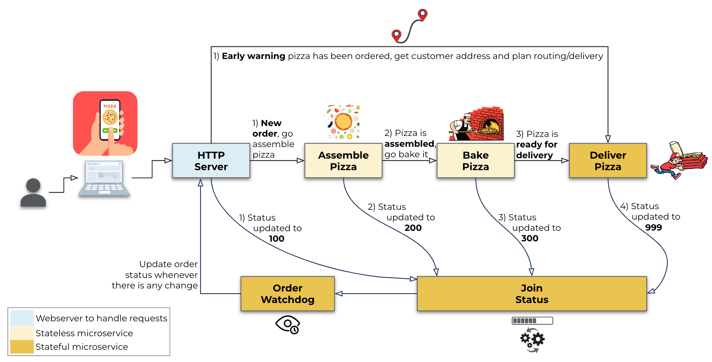
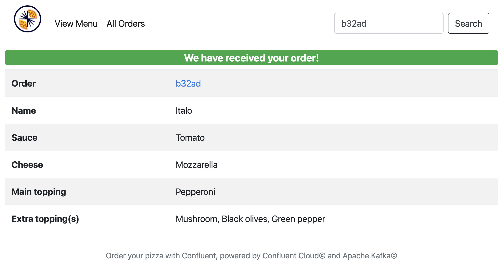
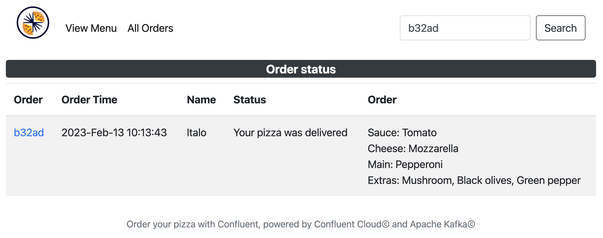
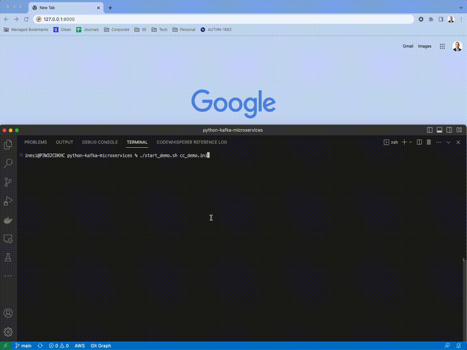

#  python-kafka-microservices 
This is an example of a microservice ecosystem using the CQRS (Command and Query Responsibility Segregation) and Event Sourcing patterns, and nothing better to explain that by using as reference a pizza takeaway shop. Who doesn't love a pizza? :blush:

## CQRS in a nutshell
CQRS is an architectural pattern that separates the responsibility of executing commands that change data (write operations) from the responsibility of retrieving data (read operations).

In a traditional application, a single model is used for both reading and writing data. However, in a CQRS architecture, separate models are used for each type of operation. This allows for a better segregation of concerns, optimization of read and write performance, more flexibility in handling complex data retrieval and manipulation requirements.

CQRS is often used in highly scalable, complex systems where there is a need for high performance, flexible data retrieval, and efficient handling of transactions. It is used in a variety of domains, including finance, e-commerce, and gaming, among others.

A lean approach to implement the CQRS patter is by using Apache Kafka as its underlying event store. The basic idea behind using Kafka for CQRS is to have separate Kafka topics for commands and queries, which allows for a clear separation of the write and read models. Here are the steps to implement CQRS with Apache Kafka:
1. Create topics for commands and queries: You need to create two distinct topics in Kafka so that you can handle them separately
2. Set up producers for commands: The commands can be in the form of events that describe the changes to be made to the data. In this project, the command topic will be a pizza order
3. Set up consumers for queries: On the other hand, you need to set up a consumer for the query topic. In this project, the query topic will be the status of the order
4. Use a materialized view to store query results: To handle read operations efficiently, you can use a materialized view to store the results of queries. The materialized view can be updated by consuming the events from the command topic and applying them to the data stored in the view. In this project, it will be used a SQLite3 data store
5. Keep the command and query topics in sync, to ensure that you need to use a mechanism such as event sourcing to keep track of all the changes made to the data. This allows you to maintain a consistent view of the data and ensure that the query results are up-to-date

## Event Sourcing in a nutshell
Event sourcing is an architectural pattern that involves storing the history of changes to a system as a sequence of events, rather than just storing the current state, or worse destroying previous states, of the system. Apache Kafka is a popular open-source platform that can be used to implement an event sourcing architecture. Here's an overview of how you can implement an event sourcing architecture using Apache Kafka:
1. Store events in a topic. Each event should represent a change to the state of the system, such as the creation, update, or deletion of an entity
2. Use producers to append events to the topic. These producers can be triggered by user actions or system events
3. Use consumers to process events. These consumers can update the system state based on the events they receive, or they can be used to create a materialized view of the data that can be used for fast querying
4. Store the state of the system, you can use a database such as a relational database, NoSQL database, an Stream Processing application such as ksqlDB/Flink, or even a simple file system. The state should be updated based on the events received by the consumers
5. Ensure durability and ordering of events by using the built-in features of Apache Kafka, such as replication and partitioning

By using an event sourcing architecture with Apache Kafka, you can benefit from a flexible, scalable, and highly available platform for storing and processing events. Additionally, you can have a clear history of all changes to the system, which can be used for auditing, debugging, or even rolling back to a previous state if necessary.

## CQRS vs Event Sourcing
While event sourcing can be used to implement CQRS, it does not necessarily imply event sourcing. In other words, CQRS is focused on the separation of write and read operations, while event sourcing is focused on storing the history of changes to a system as a sequence of events. CQRS and event sourcing can complement each other, but they are not the same thing.

## Pizza Takeaway Shop

### High level view
This pizza takeaway shop ecosystem was designed using Python and made simple for demo/learning purposes, basically the following are the app/microservices created:
- Web application using the Flask lib (```webapp.py```) so users can login to, customise their pizza, order and follow up the status of their order. This webapp will be the Command portion of the CQRS pattern. To make it simpler a SQLite3 state store* is being used as the materialised view between Command and Query, however in a real life scenario that could be an in-memory data store or ksqlDB/Flink
- Once the pizza is ordered it will go through four microservices (following the same flow of a real pizza shop):
  - Assemble the pizza as per order (```msvc_assemble.py```)
  - Bake the pizza (```msvc_bake.py```)
  - Have it delivered (```msvc_delivery.py```)
  - Process status (```msvc_status.py```): Whenever one of the previous microservices complete their task they will communicate with this microservice so it can update the web application. This microservice will be the Query portion of the CQRS pattern. It will have the materialised views stored in the aforementioned SQLite3 state store*
- All interprocess communication is via an Apache Kafka cluster

(*) By default SQLite3 will be used, but that can be changed via system configuration file (default is ```'config_sys/default.ini'```) by setting a different python class (the base/abstract class is defined on utils.db, class name is ```BaseStateStore```), see below the default system configuration:
```
[state-store-orders]
db_module_class = utils.db.sqlite

[state-store-delivery]
db_module_class = utils.db.sqlite
```

IMPORTANT: In ordert to keep consistency with Java based clients (using murmur2 partitioner), the producers will also set the topic partition using the murmur2 hash function, other than the standard CRC32 on librdkafka.

Webapp and four microservices in action:


### Low level view
Detailed view of all microservices and to what Kafka topics their produce and are subscribed to:


Confluent Cloud Stream Lineage view:


### ksqlDB queries
#### Collections
Streams and tables are the two primary abstractions, they are referred to as collections. There are two ways of creating collections in ksqlDB:
- directly from Kafka topics (source collections)
- derived from other streams and tables (derived collections)

**Source Collections**: The topics produced/consumed by the microservices need to be ingested by ksqlDB so they can be stream processed:
```
CREATE STREAM IF NOT EXISTS PIZZA_ORDERED (
    order_id VARCHAR KEY,
    status INT,
    timestamp BIGINT,
    order STRUCT<
        extra_toppings ARRAY<STRING>,
        username STRING,
        customer_id STRING,
        sauce STRING,
        cheese STRING,
        main_topping STRING
    >
) WITH (
    KAFKA_TOPIC = 'pizza-ordered',
    VALUE_FORMAT = 'JSON',
    TIMESTAMP = 'timestamp'
);

CREATE STREAM IF NOT EXISTS PIZZA_ASSEMBLED (
    order_id VARCHAR KEY,
    status INT,
    baking_time INT,
    timestamp BIGINT
) WITH (
    KAFKA_TOPIC = 'pizza-assembled',
    VALUE_FORMAT = 'JSON',
    TIMESTAMP = 'timestamp'
);

CREATE STREAM IF NOT EXISTS PIZZA_BAKED (
    order_id VARCHAR KEY,
    status INT,
    timestamp BIGINT
) WITH (
    KAFKA_TOPIC = 'pizza-baked',
    VALUE_FORMAT = 'JSON',
    TIMESTAMP = 'timestamp'
);

STREAM_DELIVERED: f"""CREATE STREAM IF NOT EXISTS PIZZA_DELIVERED (
    order_id VARCHAR KEY,
    status INT,
    timestamp BIGINT
) WITH (
    KAFKA_TOPIC = 'pizza-delivered',
    VALUE_FORMAT = 'JSON',
    TIMESTAMP = 'timestamp'
);

CREATE STREAM IF NOT EXISTS PIZZA_PENDING (
    order_id VARCHAR KEY,
    status INT,
    timestamp BIGINT
) WITH (
    KAFKA_TOPIC = 'pizza-pending',
    VALUE_FORMAT = 'JSON',
    TIMESTAMP = 'timestamp'
);

CREATE STREAM IF NOT EXISTS PIZZA_STATUS (
    order_id VARCHAR KEY,
    status INT,
    timestamp BIGINT
) WITH (
    KAFKA_TOPIC='pizza-status',
    VALUE_FORMAT='JSON',
    TIMESTAMP='timestamp'
);
```

**Derived Collections**: With the source collections created (streams) we can now extract the status field of each event and have them merged into a single topic/stream by creating persistent queries:
```
INSERT INTO PIZZA_STATUS SELECT order_id, status, timestamp FROM PIZZA_ORDERED EMIT CHANGES;
INSERT INTO PIZZA_STATUS SELECT order_id, status, timestamp FROM PIZZA_ASSEMBLED EMIT CHANGES;
INSERT INTO PIZZA_STATUS SELECT order_id, status, timestamp FROM PIZZA_BAKED EMIT CHANGES;
INSERT INTO PIZZA_STATUS SELECT order_id, status, timestamp FROM PIZZA_DELIVERED EMIT CHANGES;
INSERT INTO PIZZA_STATUS SELECT order_id, status, timestamp FROM PIZZA_PENDING EMIT CHANGES;
```

### Start now!
You can setup your own environment to do the tests, or go straight to the <a href="http://confluent-pizza-demo-1570877491.eu-west-1.elb.amazonaws.com" title="Start demo" target="_blank"><b>public demo by clicking here</b></a>.
 - Enter your username
 - No need for password
 - You will only be able to see your own orders, you cannot see someone else's

### Installation and Configuration
- SQLite3 and Python +3.8 required
- Install python virtual environment: ```python3 -m pip install venv``` or ```python3 -m pip install virtualenv```
- Clone this repo: ```git clone git@github.com:ifnesi/python-kafka-microservices.git```
- Go to the folder where the repo was cloned: ```cd python-kafka-microservices```
- Create a virtual environment: ```python3 -m venv _venv```
- Activate the virtual environment: ```source _venv/bin/activate```
- Install project requirements: ```python3 -m pip install -r requirements.txt```
- Run script to create topics*/ksqlDB streams: ```python3 run_me_first.py {KAFKA_CONFIG_FILE} {SYS_CONFIG_FILE}```
- Deactivate the virtual environment: ```deactivate```
  - ```{SYS_CONFIG_FILE}``` is a system configuration file, this file must be located under the folder ```config_sys/``` (default file is ```default.ini```)
  - ```{KAFKA_CONFIG_FILE}``` is a Kafka configuration file containing the properties to access the Apache Kafka cluster, this file must be located under the folder ```config_kafka/``` (see file ```config_kafka/example.ini``` for reference):
```
    [kafka]
    bootstrap.servers = {{ host:port }}
    security.protocol = SASL_SSL
    sasl.mechanisms = PLAIN
    sasl.username = {{ CLUSTER_API_KEY }}
    sasl.password = {{ CLUSTER_API_SECRET }}
```
(*) Topics can be changed via system configuration file (default is ```'config_sys/default.ini'```):
```
[kafka-topics]
pizza_pending = pizza-pending
pizza_ordered = pizza-ordered
pizza_assembled = pizza-assembled
pizza_baked = pizza-baked
pizza_delivered = pizza-delivered
pizza_status = pizza-status
```

### Running the webapp and microservices
- Activate the virtual environment: ```source _venv/bin/activate```
- Start the demo (all in a single terminal): ```./start_demo.sh {KAFKA_CONFIG_FILE} {SYS_CONFIG_FILE}```
- Alternativelly, so you can see the logs of each process, open five shell terminals and start each service on them:
  - Terminal #1: ```python3 msvc_status.py {KAFKA_CONFIG_FILE} {SYS_CONFIG_FILE}```
  - Terminal #2: ```python3 msvc_assemble.py {KAFKA_CONFIG_FILE} {SYS_CONFIG_FILE}```
  - Terminal #3: ```python3 msvc_bake.py {KAFKA_CONFIG_FILE} {SYS_CONFIG_FILE}```
  - Terminal #4: ```python3 msvc_delivery.py {KAFKA_CONFIG_FILE} {SYS_CONFIG_FILE}```
  - Terminal #5: ```python3 webapp.py {KAFKA_CONFIG_FILE} {SYS_CONFIG_FILE}```
- In a real life scenario each microservice (consumer in a consumer group) could be instantiated for as many times as there are partitions to the topic, however that is just for demo/learning purposes, only one instance will be spawn
- Also, for the simplicity of the demo, no Schema Registry is being used. That is not an ideal scenario as the "contract" between Producers and Consumers are "implicitly hard coded" other than being declared through the schema registry
- Open your browser and navigate to http://127.0.0.1:8000
- To stop the demo:
  - To stop all services at once: ```./stop_demo.sh```
  - If using the five terminals, press ```[CTRL-C]``` on each one of them
- Deactivate the virtual environment: ```deactivate```

### Running it all locally
Should you want to try it out on your own and run it all locally, you will need to have Docker installed, then:
- Run ```docker-compose up -d```
- Wait until the images are downloaded and the containers are up and running (1x Zookeeper server, 1x Kafka broker, 1x Schema Registry and 1x Confluent Control Center)
- Set ```{KAFKA_CONFIG_FILE}``` as ```localhost.ini```
- Then, follow the steps on the previous section to get the demo up and running
- Don't forget to create the topics before starting the demo! To do so and see the events, go to http://127.0.0.1:9021 (it takes a minute or so once all containers are up)
- Once done with it, stop your docker containers: ```docker-compose down```

### Using the webapp and of chronology of events
1. After starting all scripts and accessing the landing page (http://127.0.0.1:8000), customise your pizza and submit your order:


2. Once the order is submitted the webapp will produce an event to the Kafka topic ```pizza-ordered```:
```
(webapp) INFO 21:00:39.603 - Event successfully produced
 - Topic 'pizza-ordered', Partition #5, Offset #18
 - Key: b32ad
 - Value: {"status": 100, "timestamp": 1676235639159, "order": {"extra_toppings": ["Mushroom", "Black olives", "Green pepper"], "customer_id": "d94a6c43d9f487c1bef659f05c002213", "name": "Italo", "sauce": "Tomato", "cheese": "Mozzarella", "main_topping": "Pepperoni"}}
 ```

3. The webapp will display the confirmation of the order:


4. The microservice **Deliver Pizza** (step 1/2) receives early warning about a new order by subscribing to topic ```pizza-ordered```. In a real life scenario it would get the ```customer_id``` data and query its data store (e.g., ksqlDB/Flink) and fetch the delivery address:
```
(msvc_delivery) INFO 21:00:18.516 - Subscribed to topic(s): pizza-ordered, pizza-baked
(msvc_delivery) INFO 21:00:39.609 - Early warning to deliver order 'b32ad' to customer_id 'd94a6c43d9f487c1bef659f05c002213'
```

5. The microservice **Assemble Pizza**, which is subscribed to the topic ```pizza-ordered```, receives the order and starts assembling the pizza. It will also estimate the baking time based on the ingredients chosen. Once the pizza is assembled, it will produce an event to the topic ```pizza-assembled``` as well as another to the topic ```pizza-status```:
```
(msvc_assemble) INFO 21:00:08.500 - Subscribed to topic(s): pizza-ordered
(msvc_assemble) INFO 21:00:39.604 - Preparing order 'b32ad', assembling time is 4 second(s)
(msvc_assemble) INFO 21:00:43.608 - Order 'b32ad' is assembled!
(msvc_assemble) INFO 21:00:43.923 - Event successfully produced
 - Topic 'pizza-assembled', Partition #5, Offset #15
 - Key: b32ad
 - Value: {"baking_time": 17}
(msvc_assemble) INFO 21:00:44.847 - Event successfully produced
 - Topic 'pizza-status', Partition #5, Offset #45
 - Key: b32ad
 - Value: {"status": 200}
 ```

6. The microservice **Process Status**, which is subscribed to the topic ```pizza-status```, receives the status change event and update the database with a materialised view of the status of the order:
```
(msvc_status) INFO 21:00:12.579 - Subscribed to topic(s): pizza-status
(msvc_status) INFO 21:00:44.851 - Order 'b32ad' status updated: Your pizza is in the oven (200)
 ```

7. The microservice **Bake Pizza**, which is subscribed to the topic ```pizza-assembled```, receives the notification the pizza is assembled along with the baking time, then it bakes the pizza accordingly. Once the pizza is baked, it will produce an event to the topic ```pizza-baked``` as well as another to the topic ```pizza-status```:
```
(msvc_bake) INFO 21:00:15.319 - Subscribed to topic(s): pizza-assembled
(msvc_bake) INFO 21:00:43.927 - Preparing order 'b32ad', baking time is 17 second(s)
(msvc_bake) INFO 21:01:00.929 - Order 'b32ad' is baked!
(msvc_bake) INFO 21:01:01.661 - Event successfully produced
 - Topic 'pizza-baked', Partition #5, Offset #15
 - Key: b32ad
 - Value:
(msvc_bake) INFO 21:01:02.645 - Event successfully produced
 - Topic 'pizza-status', Partition #5, Offset #46
 - Key: b32ad
 - Value: {"status": 300}
```

8. The microservice **Process Status**, which is subscribed to the topic ```pizza-status```, receives the status change event and update the database with a materialised view of the status of the order:
```
(msvc_status) INFO 21:00:12.579 - Subscribed to topic(s): pizza-status
(msvc_status) INFO 21:01:02.647 - Order 'b32ad' status updated: Your pizza is out for delivery (300)
 ```

9. The microservice **Deliver Pizza** (step 2/2), which is subscribed to the topic ```pizza-baked```, receives the notification the pizza is baked, then it delivers the pizza. It already had time to plan the delivery as it got an early warning as soon as the order was placed. Once the pizza is delivered, it will produce an event to the topic ```pizza-status```:
```
(msvc_delivery) INFO 21:00:18.516 - Subscribed to topic(s): pizza-ordered, pizza-baked
(msvc_delivery) INFO 21:01:01.662 - Deliverying order 'b32ad' for customer_id 'd94a6c43d9f487c1bef659f05c002213', delivery time is 10 second(s)
(msvc_delivery) INFO 21:01:11.665 - Order 'b32ad' delivered to customer_id 'd94a6c43d9f487c1bef659f05c002213'
(msvc_delivery) INFO 21:01:12.899 - Event successfully produced
 - Topic 'pizza-status', Partition #5, Offset #47
 - Key: b32ad
 - Value: {"status": 400}
```

10. The microservice **Process Status**, which is subscribed to the topic ```pizza-status```, receives the status change event and update the database with a materialised view of the status of the order:
```
(msvc_status) INFO 21:00:12.579 - Subscribed to topic(s): pizza-status
(msvc_status) INFO 21:01:12.902 - Order 'b32ad' status updated: Your pizza was delivered (400)
```

11. The flow is completed and, hopefully, we now have a happy customer for getting a delicious and nutricious pizza in such fast manner. The webapp, if on the order status page (in this case http://127.0.0.1:8000/orders/b32ad) will display in real time the status of the pizza, all of that thanks to the CQRS pattern. In a real life scenario that could be easily achieved by using frameworks such as ReactJS, however in this project it is used JQuery/AJAX async calls to accomplish that:


#### **IMPORTANT 1**
Have you noticed the microservice **Deliver Pizza** is stateful as it has two steps?
- Step 1/2: Receive early warning that an order was placed (topic ```pizza-ordered```)
- Step 2/2: Receive notification the pizza is baked (topic ```pizza-baked```)

As that microservice is subscribed to two different topics, Apache Kafka cannot guarantee the order of events for the same event key. Hang on, but won't the early notification always arrive before the notification the pizza is baked (see the architecture diagram above)? The answer to that is: usually yes, as the first step happens before the second one, however what if for some reason the microservice **Deliver Pizza** is down and a bunch of events get pushed through the topics? When the microservice is brought up it will consume the events from the two topics and not necessarily in the same chronological order (for the same event key). For that reason microservice like that needs to take into account this kind of situations. On this project, if that happens the customer would first get the status "Bear with us we are checking your order, it won’t take long" (once the pizza is baked notification is processed), then would get the status "Your pizza was delivered" (once the early warning notification is processed).

#### **IMPORTANT 2**
The microservice **Process Status** is also stateful as it receives several notifications for the same event key. If that service was to be handled as stateless it would be a problem if a given order is not fully processed, for example, what if the baker decided to call it a day? The status of the order would get stuck forever as "Your pizza is in the oven". For example, it could be estimated the orders shouldn't take more than 'X minutes' between being ordered and baked and 'Y minutes' between being baked and not completed yet, creating then a SLA in between microservices, if that gets violated it could trigger a notification to state something got stuck (at least the pizza shop manager would get notified before the customer call to complain about the delay).<br><br>
What that microservice does is to spaw a new thread with an infinite loop to check the status of all orders in progress for every few seconds, like a watchdog.

### Graceful shutdown
One very important element of any Kafka consumer is by handling OS signals to be able to perform a graceful shutdown. Any consumer in a consumer group should inform the cluster it is leaving so it can rebalance itself other than wait for a timeout. All microservices used in this project have a graceful shutdown procedure in place, example:

```
(msvc_status) INFO 21:46:53.338 - Starting graceful shutdown...
(msvc_status) INFO 21:46:53.338 - Closing consumer in consumer group...
(msvc_status) INFO 21:46:53.372 - Consumer in consumer group successfully closed
(msvc_status) INFO 21:46:53.372 - Graceful shutdown completed

(msvc_assemble) INFO 21:46:54.541 - Starting graceful shutdown...
(msvc_assemble) INFO 21:46:54.541 - Closing consumer in consumer group...
(msvc_assemble) INFO 21:46:54.577 - Consumer in consumer group successfully closed
(msvc_assemble) INFO 21:46:54.577 - Graceful shutdown completed

(msvc_bake) INFO 21:46:55.968 - Starting graceful shutdown...
(msvc_bake) INFO 21:46:55.968 - Closing consumer in consumer group...
(msvc_bake) INFO 21:46:55.995 - Consumer in consumer group successfully closed
(msvc_bake) INFO 21:46:55.996 - Graceful shutdown completed

(msvc_delivery) INFO 21:46:57.311 - Starting graceful shutdown...
(msvc_delivery) INFO 21:46:57.311 - Closing consumer in consumer group...
(msvc_delivery) INFO 21:46:57.341 - Consumer in consumer group successfully closed
(msvc_delivery) INFO 21:46:57.341 - Graceful shutdown completed
```

### Demo (happy path)


Enjoy!

This project was inspired by: https://www.confluent.io/en-gb/blog/event-driven-microservices-with-python-and-kafka/

Check out Confluent's Developer portal (https://developer.confluent.io/), it has free courses, documents, articles, blogs, podcasts and so many more content to get you up and running with a fully managed Apache Kafka service

Disclaimer: I work for Confluent :wink: