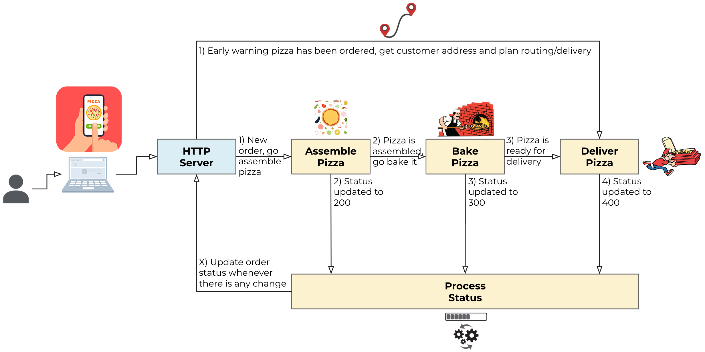

# python-kafka-microservices
This is an example of a microservice architecture using the CQRS pattern (Command and Query Responsibility Segregation), and nothing better to explain it by using as reference a pizza delivery service. Who doesn't love pizza? :)

## Service Flow
The process was made simple to make it easier to explain, basically:
- Web application (webapp) so users can login to, customise, order and follow up the status of their pizzas
- Once the pizza is ordered it will go through four microservices (following the same flow of a pizza store):
  - Assemble the pizza as per order
  - Bake the pizza
  - Have it delivered
  - Process status: Whenever a microprocess completes its activities will communicate with this process so it can update the web application
- All interprocess communication is via an Apache Kafka Cluster



## General CQRS Architecture
Below is a more detailed view of all microservices and to what Kafka topics their produce and are subscribed to:


## Installation
- Python +3.8 required
- Install python requirements: ```python3 -m pip install venv```
- Clone this repo: ```git clone git@github.com:ifnesi/python-kafka-microservices.git```
- Go to the folder where the repo was cloned: ```cd python-kafka-microservices```
- Create a virtual environment: ```python3 venv _venv```
- Activate the virtual environment: ```source _venv/bin/activate```
- Install project requirements: ```python3 -m pip install -f requirements.txt```
- Deactivate the virtual environment: ```deactivate```

## Running the webapp and microservices
- Activate the virtual environment: ```source _venv/bin/activate```
- Start the demo (all in a single terminal): ```./start_demo.sh {CONFIG_FILE}```
- Alternativelly, open five sheel terminals and start each service on them:
  - Terminal #1: ```python3 msvc_status.py {CONFIG_FILE}```
  - Terminal #2: ```python3 msvc_assemble.py {CONFIG_FILE}```
  - Terminal #3: ```python3 msvc_bake.py {CONFIG_FILE}```
  - Terminal #4: ```python3 msvc_delivery.py {CONFIG_FILE}```
  - Terminal #5: ```python3 webapp.py {CONFIG_FILE}```
- Open your browser and navigate to http://127.0.0.1:8000
- To stop the demo:
  - To stop all services at once: ```./stop_demo.sh```
  - If using the five terminals, press ```[CTRL-C]``` on each one of them
- Deactivate the virtual environment: ```deactivate```

## Using the webapp
PENDING!

## Example of chronology of events:
Order submitted (webapp):
```
(webapp) INFO 21:00:39.603 - Event successfully produced
 - Topic 'pizza-ordered', Partition #5, Offset #18
 - Key: 3c91b
 - Value: {"status": 100, "timestamp": 1676235639159, "order": {"extra_toppings": ["Mushroom", "Black olives", "Green pepper"], "customer_id": "d94a6c43d9f487c1bef659f05c002213", "name": "Italo", "sauce": "Tomato", "cheese": "Mozzarella", "main_topping": "Pepperoni"}}
 ```

Microservice Deliver Pizza (step 1/2: receive early warning about a new order by subscribing to topic ```pizza-ordered```)
```
(msvc_delivery) INFO 21:00:18.516 - Subscribed to topic(s): pizza-ordered, pizza-baked
(msvc_delivery) INFO 21:00:39.609 - Early warning to deliver order '3c91b' to customer_id 'd94a6c43d9f487c1bef659f05c002213'
```

 Microservice Assemble Pizza (started once order is submitted by subscribing to topic ```pizza-ordered```):
 ```
(msvc_assemble) INFO 21:00:08.500 - Subscribed to topic(s): pizza-ordered
(msvc_assemble) INFO 21:00:39.604 - Preparing order '3c91b', assembling time is 4 second(s)
(msvc_assemble) INFO 21:00:43.608 - Order '3c91b' is assembled!
(msvc_assemble) INFO 21:00:43.923 - Event successfully produced
 - Topic 'pizza-assembled', Partition #5, Offset #15
 - Key: 3c91b
 - Value: {"baking_time": 17}
(msvc_assemble) INFO 21:00:44.847 - Event successfully produced
 - Topic 'pizza-status', Partition #5, Offset #45
 - Key: 3c91b
 - Value: {"status": 200}
 ```

 Microservice Process Status (started whenever order status is changed by subscribing to topic ```pizza-status```):
 ```
(msvc_status) INFO 21:00:12.579 - Subscribed to topic(s): pizza-status
(msvc_status) INFO 21:00:44.851 - Order '3c91b' status updated: Your pizza is in the oven (200)
 ```

Microservice Bake Pizza (started once pizza is assembled by subscribing to topic ```pizza-assembled```)
```
(msvc_bake) INFO 21:00:15.319 - Subscribed to topic(s): pizza-assembled
(msvc_bake) INFO 21:00:43.927 - Preparing order '3c91b', baking time is 17 second(s)
(msvc_bake) INFO 21:01:00.929 - Order '3c91b' is baked!
(msvc_bake) INFO 21:01:01.661 - Event successfully produced
 - Topic 'pizza-baked', Partition #5, Offset #15
 - Key: 3c91b
 - Value:
(msvc_bake) INFO 21:01:02.645 - Event successfully produced
 - Topic 'pizza-status', Partition #5, Offset #46
 - Key: 3c91b
 - Value: {"status": 300}
```

Microservice Process Status (started whenever order status is changed by subscribing to topic ```pizza-status```):
```
(msvc_status) INFO 21:00:12.579 - Subscribed to topic(s): pizza-status
(msvc_status) INFO 21:01:02.647 - Order '3c91b' status updated: Your pizza is out for delivery (300)
 ```

Microservice Deliver Pizza (step 2/2: started once pizza is baked by subscribing to topic ```pizza-baked```)
```
(msvc_delivery) INFO 21:00:18.516 - Subscribed to topic(s): pizza-ordered, pizza-baked
(msvc_delivery) INFO 21:01:01.662 - Deliverying order '3c91b' for customer_id 'd94a6c43d9f487c1bef659f05c002213', delivery time is 10 second(s)
(msvc_delivery) INFO 21:01:11.665 - Order '3c91b' delivered to customer_id 'd94a6c43d9f487c1bef659f05c002213'
(msvc_delivery) INFO 21:01:12.899 - Event successfully produced
 - Topic 'pizza-status', Partition #5, Offset #47
 - Key: 3c91b
 - Value: {"status": 400}
```

Microservice Process Status (started whenever order status is changed by subscribing to topic ```pizza-status```):
```
(msvc_status) INFO 21:00:12.579 - Subscribed to topic(s): pizza-status
(msvc_status) INFO 21:01:12.902 - Order '3c91b' status updated: Your pizza was delivered (400)
 ```

## Graceful shutdown
One very important element of any Kafka consumer is by handling OS signals to be able to perform a graceful shutdown. Any consumer in a consumer group should inform the cluster it is leaving so it can rebalance itself other than wait for a timeout. All microservices used in this project have a graceful shutdown procedure in place, example:

```
(msvc_status) INFO 21:46:53.338 - Starting graceful shutdown...
(msvc_status) INFO 21:46:53.338 - Closing consumer group...
(msvc_status) INFO 21:46:53.372 - Consumer group successfully closed
(msvc_status) INFO 21:46:53.372 - Graceful shutdown completed

(msvc_assemble) INFO 21:46:54.541 - Starting graceful shutdown...
(msvc_assemble) INFO 21:46:54.541 - Closing consumer group...
(msvc_assemble) INFO 21:46:54.577 - Consumer group successfully closed
(msvc_assemble) INFO 21:46:54.577 - Graceful shutdown completed

(msvc_bake) INFO 21:46:55.968 - Starting graceful shutdown...
(msvc_bake) INFO 21:46:55.968 - Closing consumer group...
(msvc_bake) INFO 21:46:55.995 - Consumer group successfully closed
(msvc_bake) INFO 21:46:55.996 - Graceful shutdown completed

(msvc_delivery) INFO 21:46:57.311 - Starting graceful shutdown...
(msvc_delivery) INFO 21:46:57.311 - Closing consumer group...
(msvc_delivery) INFO 21:46:57.341 - Consumer group successfully closed
(msvc_delivery) INFO 21:46:57.341 - Graceful shutdown completed
```

 This project wass based on: https://www.confluent.io/en-gb/blog/event-driven-microservices-with-python-and-kafka/