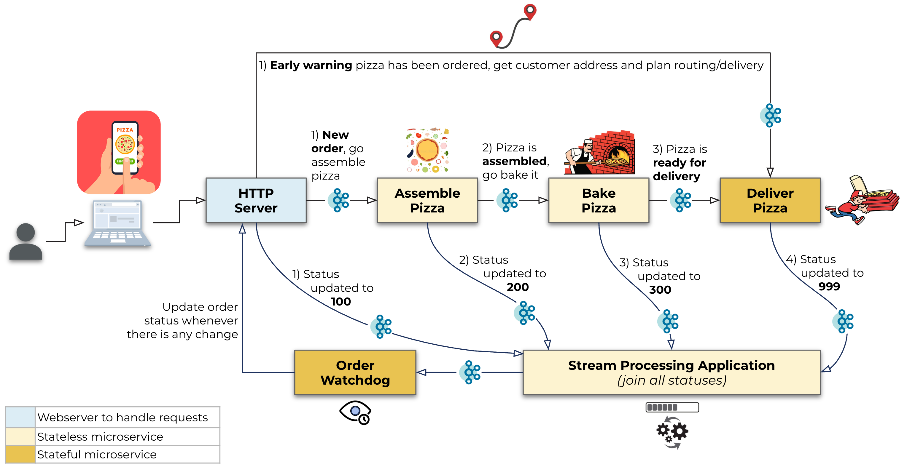
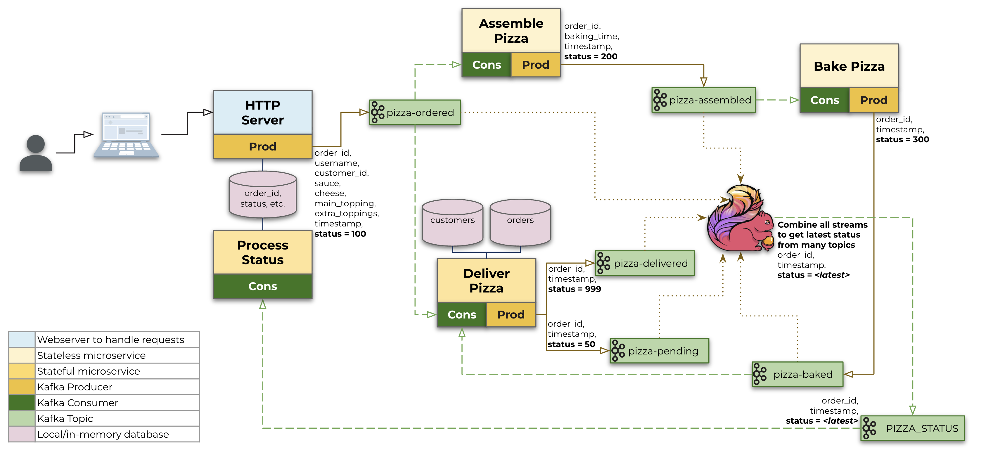
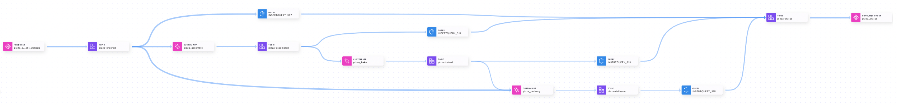
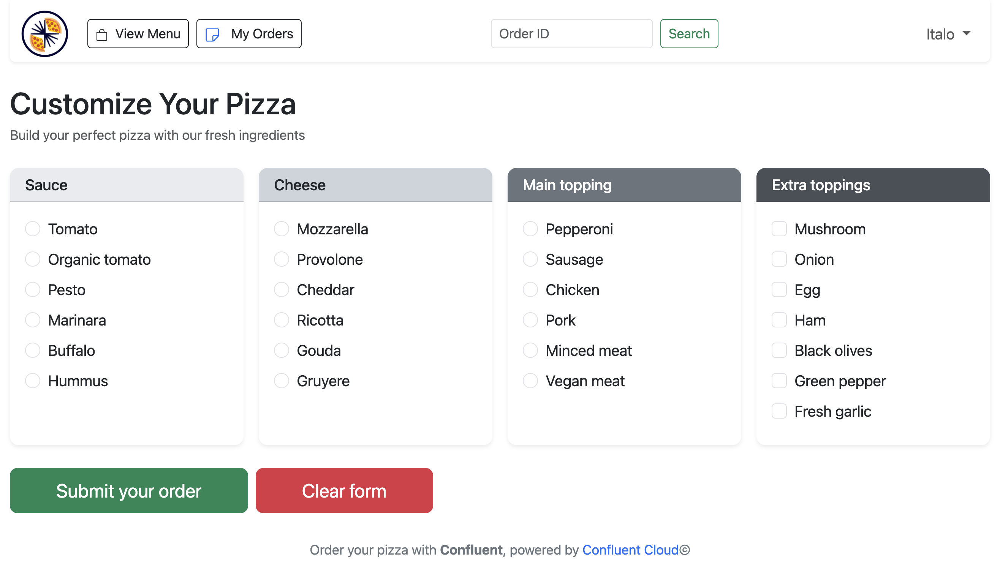
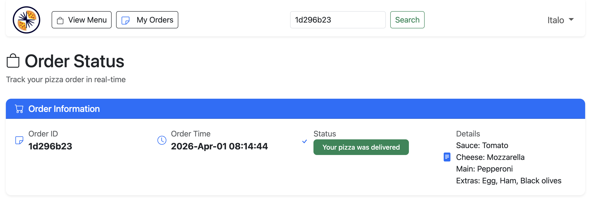
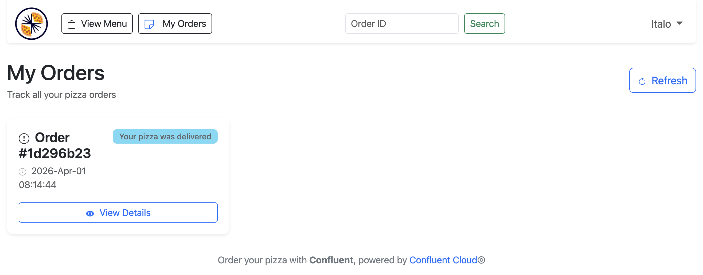

#  python-kafka-microservices 
This is an example of a microservice ecosystem using the CQRS (Command and Query Responsibility Segregation) and Event Sourcing patterns. What better way to explain these concepts than by using a pizza takeaway shop as reference? Who doesn't love pizza? :blush:

## CQRS in a Nutshell
CQRS is an architectural pattern that separates the responsibility of executing commands that change data (write operations) from the responsibility of retrieving data (read operations).

In a traditional application, a single model is used for both reading and writing data. However, in a CQRS architecture, separate models are used for each type of operation. This allows for:
- Better segregation of concerns
- Optimization of read and write performance
- More flexibility in handling complex data retrieval and manipulation requirements

CQRS is often used in highly scalable, complex systems where there is a need for high performance, flexible data retrieval, and efficient transaction handling. It is used in a variety of domains, including finance, e-commerce, and gaming.

A lean approach to implement the CQRS pattern is by using Apache Kafka as its underlying event store. The basic idea behind using Kafka for CQRS is to have separate Kafka topics for commands and queries, which allows for a clear separation of the write and read models. Here are the steps to implement CQRS with Apache Kafka:
1. **Create topics for commands and queries**: Create two distinct topics in Kafka so they can be handled separately
2. **Set up producers for commands**: Commands can be in the form of events that describe the changes to be made to the data. In this project, the command topic handles pizza orders
3. **Set up consumers for queries**: Set up a consumer for the query topic. In this project, the query topic tracks order status
4. **Use a materialized view to store query results**: To handle read operations efficiently, use a materialized view to store query results. The materialized view can be updated by consuming events from the command topic and applying them to the data stored in the view. In this project, a SQLite3 data store is used
5. **Keep the command and query topics in sync**: To ensure synchronization, use a mechanism such as event sourcing to keep track of all changes made to the data. This allows you to maintain a consistent view of the data and ensure that query results are up-to-date

## Event Sourcing in a Nutshell
Event sourcing is an architectural pattern that involves storing the history of changes to a system as a sequence of events, rather than just storing the current state (or worse, destroying previous states) of the system. Apache Kafka is a popular open-source platform that can be used to implement an event sourcing architecture. Here's an overview of how to implement event sourcing using Apache Kafka:
1. **Store events in a topic**: Each event should represent a change to the state of the system, such as the creation, update, or deletion of an entity
2. **Use producers to append events** to the topic: These producers can be triggered by user actions or system events
3. **Use consumers to process events**: These consumers can update the system state based on the events they receive, or they can be used to create a materialized view of the data for fast querying
4. **Store the system state**: You can use a database such as a relational database, NoSQL database, a stream processing application such as Flink, or even a simple file system. The state should be updated based on the events received by the consumers
5. **Ensure durability and ordering** of events by using the built-in features of Apache Kafka, such as replication and partitioning

By using an event sourcing architecture with Apache Kafka, you benefit from:
- A flexible, scalable, and highly available platform for storing and processing events
- A clear history of all changes to the system, which can be used for auditing, debugging, or even rolling back to a previous state if necessary

## CQRS vs. Event Sourcing
While event sourcing can be used to implement CQRS, CQRS does not necessarily require event sourcing. In other words:
- **CQRS** focuses on the separation of write and read operations
- **Event Sourcing** focuses on storing the history of changes to a system as a sequence of events

CQRS and event sourcing can complement each other, but they are distinct patterns.

## Pizza Takeaway Shop

### High Level View
This pizza takeaway shop ecosystem was designed using Python and kept simple for demo/learning purposes. The following applications and microservices were created:
- **Web application** using the Python Flask and REACT frameworks (```webapp.py```) that allows users to login, customize their pizza, place orders, and track order status. This webapp serves as the **Command** portion of the CQRS pattern. For simplicity, a SQLite3 state store* is used as the materialized view between Command and Query. However, in a real-world scenario, this could be an in-memory data store or Flink
- Once the pizza is ordered, it goes through four microservices (following the same flow as a real pizza shop):
  - **Assemble the pizza** as per order (```msvc_assemble.py```)
  - **Bake the pizza** (```msvc_bake.py```)
  - **Deliver the pizza** (```msvc_delivery.py```)
  - **Process status** (```msvc_status.py```): Whenever one of the previous microservices completes its task, it communicates with this microservice to update the web application. This microservice serves as the **Query** portion of the CQRS pattern and stores the materialized views in the aforementioned SQLite3 state store*
- All inter-process communication is via an Apache Kafka cluster

(*) By default, SQLite3 is used, but this can be changed via the system configuration file (default is ```'config/webapp.ini'```) by specifying a different Python class. The base/abstract class is defined in ```utils.db``` with the class name ```BaseStateStore```. See below for the default system configuration:
```
[state-store-orders]
db_module_class = utils.db.sqlite

[state-store-delivery]
db_module_class = utils.db.sqlite
```

**IMPORTANT**: In order to keep consistency with Java-based clients (using murmur2 partitioner), the producers will also set the topic partition using the murmur2 hash function, rather than the standard CRC32 on librdkafka.

**Webapp and four microservices in action:**


### Low Level View
Detailed view of all microservices and the Kafka topics they produce to and subscribe to:


Confluent Cloud Stream Lineage view:


### Flink Queries

All Flink queries are automatically created by Terraform:

```SQL
-- Create PIZZA_STATUS table in Flink
-- This table consolidates status updates from all pizza processing stages
CREATE TABLE IF NOT EXISTS PIZZA_STATUS (
  `key` BYTES,
  `status` INT,
  `timestamp` BIGINT
)
DISTRIBUTED BY HASH(`key`) INTO 6 BUCKETS
WITH (
  'key.format'   = 'raw',
  'value.format' = 'avro-registry'
);

-- Insert data into PIZZA_STATUS table in Flink
-- This statement populates the PIZZA_STATUS table with data from all pizza processing stages
EXECUTE STATEMENT SET
BEGIN
   INSERT INTO `PIZZA_STATUS` (`key`, `status`, `timestamp`) SELECT `key`, `status`, `timestamp` FROM `pizza-ordered`;
   INSERT INTO `PIZZA_STATUS` (`key`, `status`, `timestamp`) SELECT `key`, `status`, `timestamp` FROM `pizza-pending`;
   INSERT INTO `PIZZA_STATUS` (`key`, `status`, `timestamp`) SELECT `key`, `status`, `timestamp` FROM `pizza-assembled`;
   INSERT INTO `PIZZA_STATUS` (`key`, `status`, `timestamp`) SELECT `key`, `status`, `timestamp` FROM `pizza-baked`;
   INSERT INTO `PIZZA_STATUS` (`key`, `status`, `timestamp`) SELECT `key`, `status`, `timestamp` FROM `pizza-delivered`;
END;
```

## Installation and Configuration

### ☁️ Terraform + Docker

Deploy Confluent Cloud infrastructure with Terraform, run Python microservices via Docker:

1. **Prerequisites**:
   - Confluent Cloud account with OrganizationAdmin API credentials
   - Terraform
   - Docker

2. **Deploy Confluent Cloud Resources**:
   ```bash
   # Clone this repo
   git clone git@github.com:ifnesi/python-kafka-microservices.git
   cd python-kafka-microservices

   # Set Confluent Cloud credentials (see file `.env_example` for reference)

   ./setup-demo.sh
   ```

3. **Run the demo**:
   ```bash
   ./run-demo.sh

   # Web application: http://localhost:8000
   ```

4. **Stop the Demo**:
   ```bash
   ./stop-demo.sh
   ```

5. **Destroy Terraform resources**:
   ```bash
   ./destroy-demo.sh
   ```

### Using the Webapp and Chronology of Events
1. After starting all scripts and accessing the landing page (http://localhost:8000), customize your pizza and submit your order:


2. Once the order is submitted the webapp will produce an event to the Kafka topic ```pizza-ordered```:
```
(webapp) INFO 21:00:39.603 - Event successfully produced
 - Topic 'pizza-ordered', Partition #5, Offset #18
 - Key: b32ad
 - Value: {"status": 100, "timestamp": 1676235639159, "order": {"extra_toppings": ["Mushroom", "Black olives", "Green pepper"], "customer_id": "d94a6c43d9f487c1bef659f05c002213", "name": "Italo", "sauce": "Tomato", "cheese": "Mozzarella", "main_topping": "Pepperoni"}}
 ```

3. The webapp will display the confirmation of the order:


4. The microservice **Deliver Pizza** (step 1/2) receives an early warning about a new order by subscribing to the topic ```pizza-ordered```. In a real-world scenario, it would use the ```customer_id``` to query its data store (e.g., ksqlDB/Flink) and fetch the delivery address:
```
(msvc_delivery) INFO 21:00:18.516 - Subscribed to topic(s): pizza-ordered, pizza-baked
(msvc_delivery) INFO 21:00:39.609 - Early warning to deliver order 'b32ad' to customer_id 'd94a6c43d9f487c1bef659f05c002213'
```

5. The microservice **Assemble Pizza**, which is subscribed to the topic ```pizza-ordered```, receives the order and starts assembling the pizza. It also estimates the baking time based on the ingredients chosen. Once the pizza is assembled, it produces events to both the ```pizza-assembled``` and ```PIZZA_STATUS``` topics:
```
(msvc_assemble) INFO 21:00:08.500 - Subscribed to topic(s): pizza-ordered
(msvc_assemble) INFO 21:00:39.604 - Preparing order 'b32ad', assembling time is 4 second(s)
(msvc_assemble) INFO 21:00:43.608 - Order 'b32ad' is assembled!
(msvc_assemble) INFO 21:00:43.923 - Event successfully produced
 - Topic 'pizza-assembled', Partition #5, Offset #15
 - Key: b32ad
 - Value: {"baking_time": 17}
(msvc_assemble) INFO 21:00:44.847 - Event successfully produced
 - Topic 'PIZZA_STATUS', Partition #5, Offset #45
 - Key: b32ad
 - Value: {"status": 200}
 ```

6. The microservice **Process Status**, which is subscribed to the topic ```PIZZA_STATUS```, receives the status change event and updates the database with a materialized view of the order status:
```
(msvc_status) INFO 21:00:12.579 - Subscribed to topic(s): PIZZA_STATUS
(msvc_status) INFO 21:00:44.851 - Order 'b32ad' status updated: Your pizza is in the oven (200)
 ```

7. The microservice **Bake Pizza**, which is subscribed to the topic ```pizza-assembled```, receives the notification that the pizza is assembled along with the baking time, then bakes the pizza accordingly. Once the pizza is baked, it produces events to both the ```pizza-baked``` and ```PIZZA_STATUS``` topics:
```
(msvc_bake) INFO 21:00:15.319 - Subscribed to topic(s): pizza-assembled
(msvc_bake) INFO 21:00:43.927 - Preparing order 'b32ad', baking time is 17 second(s)
(msvc_bake) INFO 21:01:00.929 - Order 'b32ad' is baked!
(msvc_bake) INFO 21:01:01.661 - Event successfully produced
 - Topic 'pizza-baked', Partition #5, Offset #15
 - Key: b32ad
 - Value:
(msvc_bake) INFO 21:01:02.645 - Event successfully produced
 - Topic 'PIZZA_STATUS', Partition #5, Offset #46
 - Key: b32ad
 - Value: {"status": 300}
```

8. The microservice **Process Status**, which is subscribed to the topic ```PIZZA_STATUS```, receives the status change event and updates the database with a materialized view of the order status:
```
(msvc_status) INFO 21:00:12.579 - Subscribed to topic(s): PIZZA_STATUS
(msvc_status) INFO 21:01:02.647 - Order 'b32ad' status updated: Your pizza is out for delivery (300)
 ```

9. The microservice **Deliver Pizza** (step 2/2), which is subscribed to the topic ```pizza-baked```, receives the notification that the pizza is baked, then delivers the pizza. It already had time to plan the delivery since it received an early warning as soon as the order was placed. Once the pizza is delivered, it produces an event to the topic ```PIZZA_STATUS```:
```
(msvc_delivery) INFO 21:00:18.516 - Subscribed to topic(s): pizza-ordered, pizza-baked
(msvc_delivery) INFO 21:01:01.662 - Deliverying order 'b32ad' for customer_id 'd94a6c43d9f487c1bef659f05c002213', delivery time is 10 second(s)
(msvc_delivery) INFO 21:01:11.665 - Order 'b32ad' delivered to customer_id 'd94a6c43d9f487c1bef659f05c002213'
(msvc_delivery) INFO 21:01:12.899 - Event successfully produced
 - Topic 'PIZZA_STATUS', Partition #5, Offset #47
 - Key: b32ad
 - Value: {"status": 400}
```

10. The microservice **Process Status**, which is subscribed to the topic ```PIZZA_STATUS```, receives the status change event and updates the database with a materialized view of the order status:
```
(msvc_status) INFO 21:00:12.579 - Subscribed to topic(s): PIZZA_STATUS
(msvc_status) INFO 21:01:12.902 - Order 'b32ad' status updated: Your pizza was delivered (400)
```

11. The flow is complete and, hopefully, we now have a happy customer who received a delicious and nutritious pizza quickly. The webapp, when on the order status page (in this case http://localhost:8000/orders/b32ad), displays the pizza status in real-time, all thanks to the CQRS pattern. In a real-world scenario, this could be easily achieved using frameworks such as ReactJS. However, in this project, we use jQuery/AJAX async calls to accomplish this:


#### **IMPORTANT 1**
Have you noticed the **Deliver Pizza** microservice is stateful as it has two steps?
- Step 1/2: Receive early warning that an order was placed (topic ```pizza-ordered```)
- Step 2/2: Receive notification that the pizza is baked (topic ```pizza-baked```)

Since this microservice is subscribed to two different topics, Apache Kafka cannot guarantee the order of events for the same event key. But wait, won’t the early notification always arrive before the notification that the pizza is baked (see the architecture diagram above)? The answer is: usually yes, as the first step happens before the second one. However, what if the **Deliver Pizza** microservice is down and a bunch of events get pushed through the topics? When the microservice is brought back up, it will consume events from both topics, but not necessarily in chronological order (for the same event key). For this reason, microservices like this need to account for such situations. In this project, if that happens, the customer would first get the status "Bear with us, we are checking your order, it won’t take long" (once the pizza-baked notification is processed), then would get the status "Your pizza was delivered" (once the early warning notification is processed).

#### **IMPORTANT 2**
The **Process Status** microservice is also stateful as it receives several notifications for the same event key. If this service were handled as stateless, it would be problematic if a given order is not fully processed. For example, what if the baker decided to call it a day? The order status would be stuck forever as "Your pizza is in the oven". To prevent this, we could establish SLAs between microservices, estimating that orders shouldn't take more than 'X minutes' between being ordered and baked, and 'Y minutes' between being baked and completed. If these SLAs are violated, it could trigger a notification indicating something is stuck (at least the pizza shop manager would be notified before the customer calls to complain about the delay).

This microservice spawns a new thread with an infinite loop to check the status of all in-progress orders every few seconds, functioning like a watchdog.

### Graceful Shutdown
One very important element of any Kafka consumer is handling OS signals to perform a graceful shutdown. Any consumer in a consumer group should inform the cluster that it is leaving so the cluster can rebalance itself rather than waiting for a timeout. All microservices in this project have a graceful shutdown procedure in place. Example:

```
(msvc_status) INFO 21:46:53.338 - Starting graceful shutdown...
(msvc_status) INFO 21:46:53.338 - Closing consumer in consumer group...
(msvc_status) INFO 21:46:53.372 - Consumer in consumer group successfully closed
(msvc_status) INFO 21:46:53.372 - Graceful shutdown completed

(msvc_assemble) INFO 21:46:54.541 - Starting graceful shutdown...
(msvc_assemble) INFO 21:46:54.541 - Closing consumer in consumer group...
(msvc_assemble) INFO 21:46:54.577 - Consumer in consumer group successfully closed
(msvc_assemble) INFO 21:46:54.577 - Graceful shutdown completed

(msvc_bake) INFO 21:46:55.968 - Starting graceful shutdown...
(msvc_bake) INFO 21:46:55.968 - Closing consumer in consumer group...
(msvc_bake) INFO 21:46:55.995 - Consumer in consumer group successfully closed
(msvc_bake) INFO 21:46:55.996 - Graceful shutdown completed

(msvc_delivery) INFO 21:46:57.311 - Starting graceful shutdown...
(msvc_delivery) INFO 21:46:57.311 - Closing consumer in consumer group...
(msvc_delivery) INFO 21:46:57.341 - Consumer in consumer group successfully closed
(msvc_delivery) INFO 21:46:57.341 - Graceful shutdown completed
```

### Demo (Happy Path)


Enjoy!

---

This project was inspired by: https://www.confluent.io/en-gb/blog/event-driven-microservices-with-python-and-kafka/

Check out [Confluent's Developer Portal](https://developer.confluent.io/) - it has free courses, documentation, articles, blogs, podcasts, and much more content to get you up and running with a fully managed Apache Kafka service.

**Disclaimer**: I work for Confluent :wink: